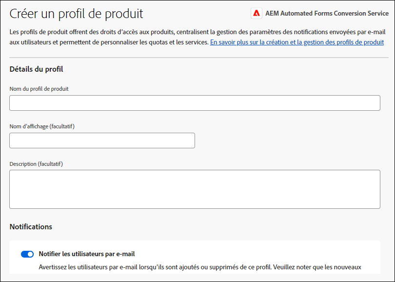

# Configurer Automated Forms Conversion service (AFCS) {#about-this-help}

Cet article décrit comment un administrateur AEM peut configurer le service de conversion automatisée de formulaires (AFCS) pour automatiser la conversion de son PDF forms en Forms adaptatif. Cet article est destiné aux administrateurs informatiques et AEM de votre entreprise. Les informations fournies sont basées sur l’hypothèse que toute personne lisant cet article connaît les technologies suivantes :

* installation, configuration et administration des packages Adobe Experience Manager et AEM ;

* utilisation des systèmes d’exploitation Linux® et Microsoft® Windows® ;

<!--- >[!VIDEO](https://video.tv.adobe.com/v/29267/) 

**Watch the video or read the article to configure Automated Forms Conversion service (AFCS)** -->

## Intégration{#onboarding}

Le service est disponible gratuitement pour les clients AEM 6.5 Forms On-Premise et les clients Adobe-Managed Service Grands comptes. Vous pouvez contacter l’équipe de ventes d’Adobe ou votre représentant Adobe pour demander l’accès au service. Le service est également disponible gratuitement et préactivé pour les clients AEM Forms as a Cloud Service.

Adobe autorise l’accès de votre entreprise et fournit les privilèges requis à la personne désignée comme administrateur au sein de votre entreprise. L’administrateur peut autoriser les développeurs (utilisateurs) AEM Forms de votre entreprise à se connecter au service.

## Prérequis {#prerequisites}

Pour utiliser Automated Forms Conversion service (AFCS), les conditions suivantes doivent être remplies :

* activation de Automated Forms Conversion service (AFCS) pour votre entreprise ;
* compte Adobe ID avec des privilèges d’administration pour le service de conversion ;
* Une version AEM 6.5 opérationnelle avec le dernier pack de services AEM ou une instance d’auteur AEM Forms as a Cloud Service avec les dernières mises à jour.
* utilisateur AEM (sur votre instance AEM) membre du groupe d’utilisateurs de formulaires.

## Configuration de l’environnement {#setuptheservice}

Avant d’utiliser le service, préparez votre instance d’auteur AEM à la connexion au service exécuté sur Adobe Cloud. Pour préparer votre instance à la connexion au service, procédez aux étapes suivantes dans l’ordre indiqué :

1. [Télécharger et installer AEM 6.5 ou intégrer AEM Forms as a Cloud Service](#aemquickstart)
1. [(Pour AEM 6.5 uniquement) Télécharger et installer le dernier pack de services AEM](#servicepack)
1. [(Pour AEM 6.5 uniquement) Télécharger et installer le dernier package complémentaire AEM Forms](#downloadaemformsaddon)
1. [Créer des thèmes et des modèles personnalisés](#referencepackage)

### 1. Téléchargez et installez AEM 6.5 ou AEM Forms as a Cloud Service intégré {#aemquickstart}


Automated Forms Conversion service (AFCS) s’exécute sur une instance de création AEM. Vous avez besoin d’AEM 6.5 ou d’AEM Forms as a Cloud Service pour configurer une instance d’auteur AEM.

* Si AEM 6.5 n’est pas en cours d’exécution, téléchargez-le à partir des emplacements ci-dessous. Après avoir téléchargé AEM, consultez la page [Déploiement et maintenance](https://helpx.adobe.com/fr/experience-manager/6-5/sites/deploying/using/deploy.html#defaultlocalinstall) pour obtenir des instructions sur la configuration d’une instance d’auteur AEM.

   * Si vous êtes déjà client AEM, téléchargez AEM 6.5 sur le [site Web Adobe Licensing](http://licensing.adobe.com).

   * Si vous êtes un partenaire Adobe, utilisez le [programme de formation des partenaires Adobe](https://adobe.allegiancetech.com/cgi-bin/qwebcorporate.dll?idx=82357Q) pour demander AEM 6.5.

* Si vous utilisez AEM Forms as a Cloud Service, consultez la section Intégration à [AEM Forms as a Cloud Service](https://experienceleague.adobe.com/docs/experience-manager-forms-cloud-service/forms/setup-environment/setup-forms-cloud-service.html?lang=fr#setup-environment) et [ Configuration d’un environnement de développement local](https://experienceleague.adobe.com/docs/experience-manager-forms-cloud-service/forms/setup-environment/setup-local-development-environment.html?lang=fr#setup-environment).

### 2. (Pour AEM 6.5 uniquement) Téléchargez et installez le dernier pack de services AEM {#servicepack}

Téléchargez et installez le dernier pack de services AEM. Pour obtenir des instructions détaillées, consultez les [Notes de mise à jour du pack de services AEM 6.5](https://experienceleague.adobe.com/fr/docs/experience-manager-65/content/release-notes/release-notes).

### 3. (Pour AEM 6.5 uniquement) Télécharger et installer le package complémentaire AEM Forms  {#downloadaemformsaddon}

Une instance AEM contient des fonctionnalités de formulaires de base. Le service de conversion nécessite toutes les capacités d’AEM Forms. Téléchargez et installez le package complémentaire AEM Forms pour bénéficier de toutes les capacités d’AEM Forms. Le package est requis pour la configuration et l’exécution du service de conversion. Pour obtenir des instructions détaillées, voir [Installation et configuration des fonctionnalités de capture de données.](https://experienceleague.adobe.com/en/docs/experience-manager-65/content/forms/install-aem-forms/osgi-installation/installing-configuring-aem-forms-osgi)
https://adminconsole.adobe.com/
>[!NOTE]
> Assurez-vous de procéder aux configurations nécessaires après l’installation du package complémentaire.
>

<!-- ### (Optional) Download and install connector package  {#installConnectorPackage}

The connector package provides early access to the [Auto-detect logical sections](convert-existing-forms-to-adaptive-forms.md#run-the-conversion) features and improvements delivered in release AFC-2020.03.1. Do not install the package if you do not require feature and improvements delivered in AFC-2020.03.1.  You can [download the connector package from AEM Package Share](https://www.adobeaemcloud.com/content/marketplace/marketplaceProxy.html?packagePath=/content/companies/public/adobe/packages/cq650/featurepack/AFCS-Connector-2020.03.1). -->


### 4. Créer des thèmes et des modèles personnalisés {#referencepackage}

Les packages de référence contiennent des exemples de thèmes et de modèles. Automated Forms Conversion service (AFCS) a besoin d’au moins un thème et un modèle pour convertir un formulaire PDF en un formulaire adaptatif. Créez un thème et un modèle personnalisés et [configurez le service](#configure-the-cloud-service) de sorte à utiliser les modèles et thèmes personnalisés avant d’utiliser le service.

Vous pouvez également télécharger et installer le package [AEM Forms Reference Assets](https://experience.adobe.com/#/downloads/content/software-distribution/en/aemcloud.html) sur votre instance d’auteur. Ce dernier crée des thèmes de référence et un modèle.

## Configuration des accès et des autorisations

Avant de poursuivre la configuration du service et de connecter votre instance au service s’exécutant sur Adobe Cloud, découvrez les rôles et les privilèges requis pour se connecter au service. Le service nécessite deux types de personnes différentes : les administrateurs et les développeurs.

* **Administrateurs** : les administrateurs sont responsables de la gestion des logiciels et des services Adobe pour leur entreprise. Les administrateurs et administratrices autorisent les développeurs et développeuses de leur entreprise à se connecter à Automated Forms Conversion service (AFCS) exécuté sur Adobe Cloud. Lorsqu’un membre de l’administration est nommé pour une entreprise, il reçoit un e-mail intitulé **[!UICONTROL « Vous disposez désormais des droits d’administration pour gérer les logiciels et services Adobe pour votre entreprise »]**. Si vous êtes un administrateur, vérifiez si vous avez reçu le message mentionné ci-dessus et [accordez l’accès aux développeurs de votre entreprise](#adduseranddevs).


* **Développeurs** : un développeur connecte une instance d’auteur AEM Forms au service AFCS (Automated Forms Conversion Service) s’exécutant sur Adobe Cloud. Lorsqu’un administrateur ou une administratrice autorise un développeur ou une développeuse à se connecter à Automated Forms Conversion service (AFCS), ce dernier ou cette dernière reçoit un e-mail intitulé « Vous disposez désormais d’un accès en tant que développeur ou développeuse pour gérer les intégrations d’API Adobe de votre entreprise ». Si vous êtes un développeur, vérifiez si vous avez reçu le message mentionné ci-dessus et [connectez votre instance AEM locale au service de conversion automatisée de formulaires sur Adobe Cloud.](#connectafcadobeio)


### Accorder l’accès aux développeurs de votre organisation

Une fois qu’Adobe a autorisé l’accès de votre entreprise et octroyé les privilèges requis à l’administrateur ou à l’administratrice, ce dernier ou cette dernière peut se connecter à l’Admin Console (voir les instructions détaillées ci-dessous), créer un profil et ajouter des développeurs et des développeuses au profil. Les développeurs peuvent connecter une instance d’AEM Forms au service de conversion automatisée de formulaires (AFCS) sur Adobe Cloud.

Les développeurs et les développeuses sont des membres de votre entreprise désignés pour exécuter le service de conversion. Seuls les développeurs ajoutés au profil du service de conversion automatisée de formulaires Adobe (AFCS) sont autorisés à utiliser le service de conversion automatisée de formulaires (AFCS).
Pour créer un profil et y ajouter des développeurs, procédez comme suit : Au moins un profil est nécessaire pour accorder l’accès requis aux développeurs de votre entreprise :

1. Connectez-vous à l’[Admin Console](https://adminconsole.adobe.com/). Utilisez **Adobe ID** de l’administrateur configuré pour utiliser le service AFCS (Automated Forms Conversion Service) pour vous connecter.
1. Cliquez sur l’option **[!UICONTROL Automated Forms Conversion]** (Conversion automatisée de formulaires).
1. Cliquez sur **[!UICONTROL New Profile]** (Nouveau profil) dans l’onglet **[!UICONTROL Products]** (Produits).
1. Renseignez les champs suivants dans le profil :**[!UICONTROL Name]** (Nom), **[!UICONTROL Display Name]** (Nom d’affichage) et **[!UICONTROL Description]**. Cliquez sur **[!UICONTROL Done]** (Terminé). Par exemple, créez un profil en tant que **AFC_Flamingo_Test_Dev**.

   

1. Ajoutez un développeur au profil. Pour ajouter les développeurs :
   1. Dans l’[Admin Console](https://adminconsole.adobe.com/enterprise), accédez à l’onglet de présentation.
   1. Cliquez sur **[!UICONTROL Assign Developers]** (Attribuer des développeurs) sur la carte de produit requise.
   1. Saisissez les adresses électroniques des développeurs et éventuellement leurs noms et prénoms.
   1. Sélectionnez les profils de produits. Cliquez sur **[!UICONTROL Enregistrer]**.

Répétez les étapes ci-dessus pour tous les utilisateurs. Pour plus de détails sur l’ajout de développeurs, consultez la page [Gérer les développeurs](https://helpx.adobe.com/fr/enterprise/using/manage-developers.html).

Une fois qu’un administrateur ajoute des développeurs au profil Adobe I/O, les développeurs sont avertis par e-mail (s’ils sont configurés).

<!--
### Configure email notification for local AEM Forms instance

Automated Forms Conversion service (AFCS) uses the Day CQ mail service to send email notifications. These email notifications contain information about successful or failed conversions. If you choose not receive notification, skip these steps. Perform the following steps to configure the Day CQ Mail Service:

* **For AEM 6.5 Forms**:

   1. Go to AEM configuration manager at `http://[server]:[port]/system/console/configMgr`
   2. Open the Day CQ Mail Service configuration. Specify a value for the **[!UICONTROL SMTP server host name]**, **[!UICONTROL SMTP server port]**, and **[!UICONTROL From address]** fields. Click **[!UICONTROL Save]**.

      You can contact your email service provider or IT administrator for information about host name and port of SMTP server. You can use any valid email address in the from field. For example, notification@example.com or donotreply@example.com.

   3. Open the **[!UICONTROL Day CQ Link Externalizer]** configuration. In the **[!UICONTROL Domains]** field, specify the actual host name or IP address and port number for local, author, and publish instances. Click **[!UICONTROL Save]**.

* For AEM Forms as a Cloud Service, [log a support ticket to enable the email service](https://experienceleague.adobe.com/docs/experience-manager-cloud-service/implementing/developing/development-guidelines.html?lang=en#sending-email). -->

### Ajouter un utilisateur au groupe forms-users {#adduserstousergroup}

Indiquez une adresse électronique dans le profil de l’utilisateur AEM désigné pour exécuter le service. Assurez-vous que l’utilisateur ou l’utilisatrice est membre du groupe **forms-users**. Les courriers électroniques sont envoyés à l’adresse de l’utilisateur qui procède à la conversion. Pour indiquer l’adresse de l’utilisateur et ajouter un utilisateur au groupe d’utilisateurs de formulaires :

1. Connectez-vous à votre instance d’auteur AEM Forms en tant qu’administrateur AEM. Utilisez vos identifiants AEM locaux pour vous connecter.
1. Cliquez sur **[!UICONTROL Adobe Experience Manager]** > **[!UICONTROL Outils]** > **[!UICONTROL Sécurité]** > **[!UICONTROL Utilisateurs]**.
1. Sélectionnez un utilisateur désigné pour exécuter le service de conversion et cliquez sur **[!UICONTROL Propriétés]**. La page **Modifier les paramètres utilisateur** s’affiche.
1. Indiquez une adresse e-mail dans le champ **[!UICONTROL E-mail]** et cliquez sur **[!UICONTROL Enregistrer]**. Les courriers électroniques sont envoyés à l’adresse indiquée en cas de réussite ou d’échec de la conversion.

   
1. Cliquez sur l’onglet **Groupes**. Dans l’onglet Sélectionner un groupe , saisissez et sélectionnez le groupe **forms-users**.
1. Cliquez sur **Enregistrer et fermer**. L’utilisateur est maintenant membre du groupe forms-users.

   

## Connectez votre instance AEM Forms au service de conversion automatisée de formulaires (AFCS) sur Adobe Cloud

Une fois qu’un administrateur vous a fourni l’accès développeur, vous pouvez connecter votre instance AEM Forms au service de conversion automatisée de formulaires (AFCS) s’exécutant sur Adobe Cloud.
Pour connecter l’instance AEM Forms au service de conversion automatisée de formulaires, procédez comme suit :

[1. Configuration des API de service sur Adobe Developer Console](#configure-the-service-apis-on-adobe-developer-console)

[2. Créer des configurations Adobe IMS](#2-create-adobe-ims-configurations)

[3. Créer une configuration de conversion automatisée de formulaires](#3-create-automated-forms-conversion-configuration)

### 1. Configuration des API de service sur Adobe Developer Console

Pour utiliser le service de conversion automatisée de formulaires (AFCS), créez un projet et ajoutez l’API **Service de configuration de Forms automatisé** au projet sur Adobe Developer Console. L’intégration génère la clé API, le secret client, l’ID de compte technique, les portées et l’ID d’organisation.
Pour configurer l’API du service de conversion automatisée de formulaires sur Adobe Developer Console, procédez comme suit :

1. Connectez-vous à https://developer.adobe.com/console . Utilisez votre Adobe ID et le compte de développeur que votre administrateur a mis à votre disposition pour vous connecter à la console Adobe I/O.
1. Sélectionnez votre entreprise dans le coin supérieur droit. Si vous ne connaissez pas le nom de votre entreprise, contactez votre administrateur.
1. Cliquez sur **[!UICONTROL Create new project]** (Créer un projet). Un écran permettant de commencer votre nouveau projet s’affiche.

   

1. Cliquez sur **[!UICONTROL Ajouter une API]**. Un écran avec la liste de toutes les API activées pour votre compte apparaît.
   

1. Sélectionnez **[!UICONTROL Service de conversion automatisée de formulaires]** et cliquez sur **[!UICONTROL Suivant]**. Un écran de configuration de l’API apparaît.
   

1. Sélectionnez la méthode d’authentification **OAuth de serveur à serveur**.
1. Spécifiez le **[!UICONTROL Nom d’identification]** et cliquez sur **[!UICONTROL Suivant]**.
   
1. Sélectionnez un **Profil de produit**. Par exemple, sélectionnez un profil en tant que **AFC_Flamingo_Test_Dev**.
1. Cliquez sur **[!UICONTROL Enregistrer l’API configurée]**. 
   

   >[!NOTE]
   >
   > Sélectionnez le profil créé lors de l’octroi de l’accès aux développeurs de votre organisation. Si vous ne savez pas quel profil sélectionner, contactez votre administrateur.

1. Cliquez sur **[!UICONTROL OAuth de serveur à serveur]** pour afficher la clé API, le secret client et d’autres informations requises pour connecter votre instance AEM au service de conversion automatisée de formulaires (AFCS).
   

   Les informations de la page sont utilisées pour créer la configuration IMS, comme expliqué dans la section [Créer une configuration technique IMS sur l’instance de création AEM](#2-create-ims-technical-configuration-on-aem-author-instance).

   

### 2. Créer des configurations Adobe IMS

Connectez-vous à votre instance de création pour créer les configurations Adobe IMS. Utilisez la variable **Détails des informations d’identification OAuth** pour récupérer la clé API, le secret client, l’ID de compte technique, les portées et l’ID d’organisation.

1. Connectez-vous à votre instance d’auteur AEM Forms. Accédez à **[!UICONTROL Outils]**> **[!UICONTROL Sécurité]** > **[!UICONTROL Configurations d’Adobe IMS]**.
1. Cliquez sur **[!UICONTROL Créer]**.

   

1. La page **[!UICONTROL Adobe IMS Technical Account Configuration]** (Configuration de compte technique Adobe IMS) s’affiche.

   
1. Sélectionnez **[!UICONTROL Service de conversion automatisée de formulaires]** dans **Solution cloud**.
1. Indiquez les informations suivantes :

   * **Titre** : indiquez un titre.
   * **Serveur d’autorisation** : [https://ims-na1.adobelogin.com](https://ims-na1.adobelogin.com)
   * Récupérez les éléments suivants à partir de la section [Configurer les API de service sur Adobe Developer Console](#1-configure-the-service-apis-on-adobe-developer-console) :
      * **ID client** : copiez et collez **clé API (ID client)**.
      * **Secret client** : copiez et collez **Secret client**.
      * **Portée** : copiez et collez **Portées**.
      * **ID d’organisation** : copiez et collez **ID de compte technique**.

     

1. Cliquez sur **[!UICONTROL Enregistrer]**. La configuration Adobe IMS est créée.

   >[!CAUTION]
   >
   > Créez une seule configuration IMS. Ne créez pas plusieurs configurations IMS.

1. Sélectionnez la **configuration Adobe IMS** et cliquez sur **[!UICONTROL Contrôle de l’intégrité]**. Une boîte de dialogue s’affiche.
   

   Une boîte de dialogue **Vérifier** s’affiche.

1. Cliquez sur **[!UICONTROL Vérifier]**.

   

   Une fois la connexion établie, le message *Token retrieved successfully* (Jeton récupéré) s’affiche.

   

1. Cliquez sur **Fermer**.

### 3. Créer une configuration de conversion automatisée de formulaires

Créez une configuration de conversion automatisée de formulaires pour connecter votre instance AEM au service de conversion. Cela vous permet également de spécifier un modèle, un thème et des fragments de formulaire pour une conversion. Vous pouvez créer plusieurs configurations de service cloud distinctes pour chaque jeu de formulaires.
Par exemple, vous pouvez avoir une configuration donnée pour les formulaires du service commercial et une autre pour les formulaires de support client. Pour créer une configuration de service cloud, procédez comme suit :

1. Sur votre instance AEM Forms, cliquez sur **[!UICONTROL Adobe Experience Manager]** > **[!UICONTROL Outils]**> **[!UICONTROL Services cloud]** > **[!UICONTROL Automatiser la configuration de la conversion Forms]**.
1. Sélectionnez le dossier **[!UICONTROL Global]** et cliquez sur **[!UICONTROL Créer]**.
La page **Créer une configuration de conversion automatisée de formulaires** s’affiche. La configuration est créée dans le dossier **Global**. Vous pouvez également créer la configuration dans un dossier différent qui existe déjà ou créer un dossier pour vos configurations.
   
1. Sur la page **[!UICONTROL Créer une configuration de conversion automatisée de formulaires]**, spécifiez la valeur des champs suivants et cliquez sur **[!UICONTROL Suivant]**.

   

   | Champ | Description |
   |--- |--- |
   | Title (Titre) | Titre unique pour la configuration. Le titre s’affiche dans l’interface utilisateur utilisée pour démarrer la conversion. |
   | Name (Nom) | Nom unique pour la configuration. La configuration est enregistrée dans le référentiel crx-repository sous le nom indiqué. Le nom peut être identique au titre. |
   | Thumbnail location (Emplacement de la miniature) | Emplacement de la miniature de la configuration. |
   | Service URL (URL du service) | URL de Automated Forms Conversion service (AFCS) sur Adobe Cloud. Utilisez l’URL suivante : `https://aemformsconversion.adobe.io/`. |
   | Template (Modèle) | Modèle par défaut à appliquer aux formulaires convertis. Vous pouvez toujours indiquer un modèle différent avant de démarrer la conversion. Un modèle contient une structure de base et un contenu initial pour un formulaire adaptatif. Vous pouvez choisir un modèle parmi les modèles prêts à l’emploi. Vous pouvez également créer un modèle personnalisé. |
   | Theme (Thème) | Thème par défaut à appliquer aux formulaires convertis. Vous pouvez toujours indiquer un thème différent avant de démarrer la conversion.  Vous pouvez cliquer sur l’icône pour choisir un thème prêt à l’emploi. Vous pouvez également créer un thème personnalisé. |
   | Existing Fragments (Fragments existants) | Emplacement des fragments existants, le cas échéant. |
   | Custom Meta-model (Métamodèle personnalisé) | Chemin d’accès du fichier .schema.json du métamodèle personnalisé. Vous pouvez créer des métamodèles distincts pour l’anglais, le français, l’allemand, l’espagnol, l’italien et le portugais. |

1. Dans l’onglet **[!UICONTROL Advanced]** (Avancé) de la page **[!UICONTROL Create Automated Forms Conversion Configuration]** (Créer une configuration de conversion automatisée de formulaires), spécifiez la valeur des champs suivants :
   

   <table>
   <thead>
   <tr>
   <th>Champ</th>
   <th>Description</th>
   </tr>
   </thead>
   <tbody>
   <tr>
   <td >Generate Document of Record (Générer un document d’enregistrement)</td>
   <td>Sélectionnez l’option pour générer automatiquement un document d’enregistrement pour les formulaires convertis. L’option est uniquement destinée aux formulaires basés sur XFA (formulaires XDP et PDF). Lorsque vous activez l’option, après l’envoi d’un formulaire, vous pouvez autoriser vos clients à conserver un enregistrement, sous forme imprimée ou en tant que document, des informations qu’ils ont intégrées au formulaire à des fins de référence ultérieure. On parle ici de document d’enregistrement.</td>
   </tr>
   <tr>
   <td>Enable Analytics (Activer Adobe Analytics)</td>
   <td>(Pour AEM 6.5) Sélectionnez l’option pour activer Adobe Analytics sur tous les formulaires convertis. Avant d’utiliser cette option, assurez-vous qu’Adobe Analytics est activé pour votre instance AEM Forms.</td>
   </tr>
   </tbody>
   </table>

   * Lorsque la source est un formulaire basé sur XFA avec l’extension .XDP, le document d’enregistrement de sortie conserve la disposition XFA. Sinon, le service de conversion utilise un modèle prêt à l’emploi pour générer un document d’enregistrement pour d’autres formulaires basés sur XFA.
   * Lors de l’envoi d’un formulaire XFA, les données d’envoi du formulaire sont enregistrées en tant qu’attribut ou élément XML. Par exemple, `<Amount currency="USD"> 10.00 </Amount>`. La devise est enregistrée en tant qu’attribut et le montant de la devise, 10.00, est enregistré en tant qu’élément. L’envoi de données d’un formulaire adaptatif n’a pas d’attributs, simplement des éléments. Ainsi, lorsqu’un formulaire basé sur XFA est converti en formulaire adaptatif, les données d’envoi de formulaire adaptatif contiennent un élément pour chacun de ces attributs. Par exemple :

   ```css
      {
         "Type": "Principal",
   
         "Amount": "10.00",
   
         "currency": "USD"
      }
   ```

1. Cliquez sur **[!UICONTROL Créer]**. La configuration cloud est alors créée. Votre instance AEM Forms est prête à commencer la conversion des formulaires hérités en Forms adaptatif.
