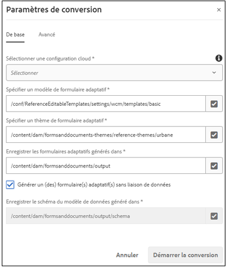
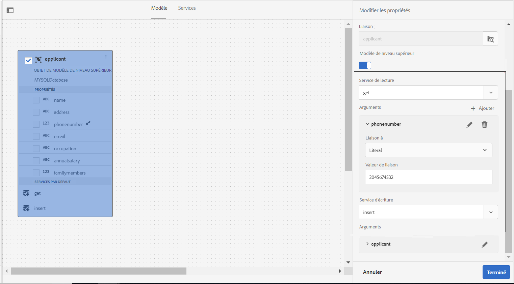
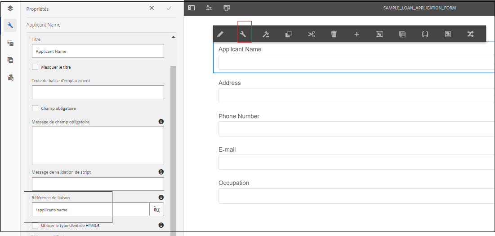
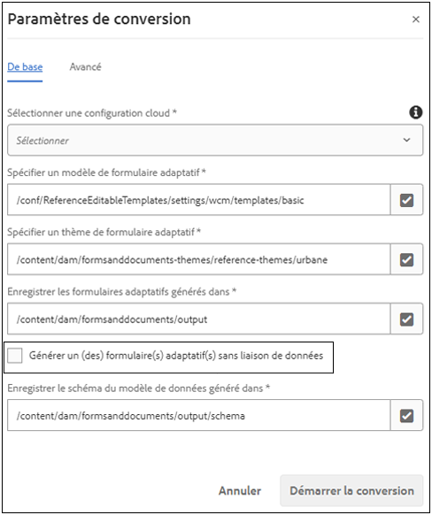

# Workflows recommandés de préremplissage et d’envoi de formulaires adaptatifs sur la base de sources de données {#recommended-data-source-btased-prefill-and-submit-workflows-for-adaptive-forms}

Vous pouvez utiliser l’une des sources de données suivantes avec des formulaires adaptatifs convertis à l’aide du service de conversion automatisée de formulaires :

* modèle de données de formulaire, OData, ou tout autre service tiers ;
* schéma JSON ;
* schéma XSD.

Selon la source de données, vous pouvez choisir de générer un formulaire adaptatif avec ou sans modèle de données.

Cet article décrit les processus recommandés pour préremplir les valeurs de champ et les options d’envoi après avoir sélectionné une source de données et généré un formulaire adaptatif à l’aide du service de conversion.

<table> 
 <tbody> 
  <tr> 
   <th><strong>Source de données</strong></th> 
   <th><strong>Processus recommandé</strong></th> 
  </tr> 
  <tr> 
   <td><p>modèle de données de formulaire, OData, ou tout autre service tiers ;</p></td> 
   <td> 
    <p><strong>Option 1</strong> : vous sélectionnez le modèle de données de formulaire, OData, ou tout autre service tiers comme source de données. Vous <a href="#generate-adaptive-forms-with-no-data-binding">générez un formulaire adaptatif sans liaison de données</a> à l’aide du service de conversion automatisée de formulaires. Vous liez manuellement les champs de formulaire adaptatif aux entités de modèle de données de formulaire et utilisez l’option Form Data Model Prefill Service (Service de préremplissage de modèle de données de formulaire) pour préremplir les valeurs de champ. Vous utilisez l’option Submit using Form Data Model (Envoyer à l’aide du modèle de données de formulaire) pour envoyer le formulaire adaptatif.</p></td> 
  </tr>
  <tr> 
   <td></td> 
   <td> 
   <p><strong>Option 2</strong> : vous sélectionnez le modèle de données de formulaire, OData, ou tout autre service tiers comme source de données. Vous <a href="#generate-adaptive-forms-with-no-data-binding">générez un formulaire adaptatif sans liaison de données</a> à l’aide du service de conversion automatisée de formulaires. Vous liez les champs de formulaire adaptatif à l’aide de l’éditeur de règles pour préremplir les valeurs de champs. Si nécessaire, modifiez les valeurs de champ et envoyez les données au référentiel crx-repository.</p>
    </td> 
  </tr>
  <tr> 
   <td></td> 
   <td> 
    <p>Pour obtenir des instructions détaillées sur l’exécution de ces processus, consultez la section <a href="#sqldatasource">Utiliser la base de données, OData, ou tout autre service tiers comme source de données</a>.</p> </td> 
  </tr>
  <tr>
  <td><p>Schéma JSON</p></td> 
   <td> 
    <p>Vous sélectionnez le schéma JSON comme source de données. Selon la source de données sélectionnée :</p></td> 
  </tr>
  <tr>
  <td></td> 
   <td> 
    <p><strong>Option 1</strong> : vous <a href="#generate-adaptive-forms-with-no-data-binding">générez un formulaire adaptatif sans liaison de données</a> à l’aide du service de conversion automatisée de formulaires et configurez le schéma JSON comme source de données. Vous liez manuellement les champs de formulaire adaptatif au schéma JSON et <a href="https://helpx.adobe.com/fr/experience-manager/6-5/forms/using/prepopulate-adaptive-form-fields.html#Supportedprotocolsforprefillinguserdata" target="_blank">utilisez l’un des protocoles pris en charge</a> pour préremplir les valeurs de champ. Si nécessaire, modifiez les valeurs de champ et envoyez les données au référentiel crx-repository.</p></td> 
  </tr>
  <tr>
  <td></td> 
   <td> 
    <p>Pour obtenir des instructions détaillées sur l’exécution des processus, consultez la section <a href="#jsondatasource">Utiliser le schéma JSON comme source de données.</p></td> 
  </tr>
  <tr>
  <td></td> 
   <td> 
    <p><strong>Option 2</strong> : vous <a href="#generate-adaptive-forms-with-json-binding">générez un formulaire adaptatif avec liaison de données JSON</a> à l’aide du service de conversion automatisée de formulaires. Le service de préremplissage et la fonction d’envoi de formulaire fonctionnent sans problème. Aucune étape de configuration n’est nécessaire.</p> </td> 
  </tr>
   <tr>
  <td></td> 
   <td> 
    <p>Pour obtenir des instructions détaillées sur l’exécution des processus, consultez la section <a href="#jsonwithdatabinding">Utiliser le schéma JSON comme source de données</a>.</p> </td> 
  </tr>
  <tr>
  <td><p>schéma XSD.</p></td> 
   <td> 
    <p>Vous sélectionnez le schéma XSD comme source de données. Selon la source de données sélectionnée, vous <a href="#generate-adaptive-forms-with-no-data-binding">générez un formulaire adaptatif sans liaison de données</a> à l’aide du service de conversion automatisée de formulaires et configurez le schéma XSD comme source de données. Vous liez manuellement les champs de formulaire adaptatif au schéma XSD et <a href="https://helpx.adobe.com/fr/experience-manager/6-5/forms/using/prepopulate-adaptive-form-fields.html#Supportedprotocolsforprefillinguserdata" target="_blank">utilisez l’un des protocoles pris en charge</a> pour préremplir les valeurs de champ. Si nécessaire, modifiez les valeurs de champ et envoyez les données au référentiel crx-repository.</p>
    </td> 
  </tr>
  <tr>
  <td></td> 
   <td> 
    <p>Pour obtenir des instructions détaillées sur l’exécution des processus, consultez la section <a href="#xsddatasource">Utiliser le schéma XSD comme source de données</a>.</p>
    </td> 
  </tr>
 </tbody> 
</table>


Pour plus d’informations sur le service de conversion automatisée de formulaires, consultez les articles suivants :

* [Présentation du service de conversion automatisée de formulaires](introduction.md)
* [Configuration du service de conversion automatisée de formulaires](configure-service.md)
* [Convertir des formulaires imprimés en formulaires adaptatifs](convert-existing-forms-to-adaptive-forms.md)
* [Vérifier et corriger les formulaires convertis](review-correct-ui-edited.md)

Ces articles s’adressent à un public qui possède une connaissance de base des concepts liés aux formulaires adaptatifs.

## Prérequis {#pre-requisites}

* Configuration d’une [instance d’auteur AEM](https://helpx.adobe.com/fr/experience-manager/6-5/sites/deploying/using/deploy.html)
* Configuration du [service de conversion automatisée de formulaires sur l’instance d’auteur AEM](configure-service.md)

## Exemple de formulaire adaptatif {#sample-adaptive-form}

Pour mettre en pratique les cas d’utilisation afin de préremplir les valeurs de champ dans un formulaire adaptatif et les envoyer à la source de données, téléchargez l’exemple de fichier PDF suivant.

Exemple de formulaire de demande de prêt

[Obtenir le fichier](assets/sample_loan_application_form.pdf)

Le fichier PDF sert d’entrée au service de conversion automatisée de formulaires. Le service convertit ce fichier en un formulaire adaptatif. L’image suivante montre un exemple de formulaire de demande de prêt au format PDF.


## Préparer les données pour le modèle de formulaire {#prepare-data-for-form-model}

L’intégration de données AEM Forms permet de configurer des sources de données disparates et de s’y connecter. Après avoir généré un formulaire adaptatif à l’aide du processus de conversion, vous pouvez définir le modèle de formulaire en fonction d’un modèle de données de formulaire, XSD, ou d’un schéma JSON. Vous pouvez utiliser une base de données, Microsoft Dynamics, ou tout autre service tiers pour créer un modèle de données de formulaire.

Ce tutoriel utilise la base de données MySQL comme source pour créer un modèle de données de formulaire. Créez un schéma **loanapplication** dans la base de données et ajoutez-y un tableau **applicant** en fonction des champs disponibles dans le formulaire adaptatif.


Vous pouvez utiliser l’instruction DDL suivante pour créer le tableau **applicant** dans la base de données.

```sql
CREATE TABLE `applicant` (
   `name` varchar(45) DEFAULT NULL,
   `address` varchar(45) DEFAULT NULL,
   `phonenumber` int(11) NOT NULL,
   `email` varchar(45) DEFAULT NULL,
   `occupation` varchar(45) DEFAULT NULL,
   `annualsalary` varchar(45) DEFAULT NULL,
   `familymembers` int(11) DEFAULT NULL,
   PRIMARY KEY (`phonenumber`)
 ) ENGINE=InnoDB DEFAULT CHARSET=utf8
```

Si vous utilisez un schéma XSD comme modèle de formulaire pour mettre en pratique les cas d’utilisation, créez un fichier XSD avec le texte suivant :

```xml
<?xml version="1.0" encoding="utf-8" ?>
    <xs:schema targetNamespace="http://adobe.com/sample.xsd"
                    xmlns="http://adobe.com/sample.xsd"
                    xmlns:xs="http://www.w3.org/2001/XMLSchema">

<xs:element name="sample" type="SampleType"/>

  <xs:complexType name="SampleType">
    <xs:sequence>
      <xs:element name="name" type="xs:string"/>
   <xs:element name="address" type="xs:string"/>
   <xs:element name="phonenumber" type="xs:int"/>
   <xs:element name="email" type="xs:string"/>
   <xs:element name="occupation" type="xs:string"/>
   <xs:element name="annualsalary" type="xs:string"/>
   <xs:element name="familymembers" type="xs:string"/>
 </xs:sequence>
  </xs:complexType>

  </xs:schema>
```

Ou téléchargez le schéma XSD sur le système de fichiers local.

Exemple de schéma XSD de demande de prêt

[Obtenir le fichier](assets/loanapplication.xsd)

Pour plus d’informations sur l’utilisation du schéma XSD comme modèle de formulaire dans les formulaires adaptatifs, consultez [Créer des formulaires adaptatifs à l’aide du schéma XML](https://helpx.adobe.com/fr/experience-manager/6-5/forms/using/adaptive-form-xml-schema-form-model.html).

Si vous utilisez un schéma JSON comme modèle de formulaire pour mettre en pratique les cas d’utilisation, créez un fichier JSON avec le texte suivant :

```JSON
{
    "$schema": "http://json-schema.org/draft-04/schema#",
    "definitions": {
        "loanapplication": {
            "type": "object",
            "properties": {
                "name": {
                    "type": "string"
                },
                "address": {
                    "type": "string"
                },
    "phonenumber": {
                    "type": "number"
                },
    "email": {
                    "type": "string"
                },
    "occupation": {
                    "type": "string"
                },
    "annualsalary": {
                    "type": "string"
                },
    "familymembers": {
                    "type": "number"
                }
            }
        }
 },
 "type": "object",
    "properties": {
        "employee": {
            "$ref": "#/definitions/loanapplication"
        }
    }
}
```

Ou téléchargez le schéma JSON sur le système de fichiers local.

Exemple de schéma JSON de demande de prêt

[Obtenir le fichier](assets/demo_schema.json)

Pour plus d’informations sur l’utilisation du schéma JSON comme modèle de formulaire dans les formulaires adaptatifs, consultez [Créer des formulaires adaptatifs à l’aide du schéma JSON](https://helpx.adobe.com/fr/experience-manager/6-5/forms/using/adaptive-form-json-schema-form-model.html).

## Générer des formulaires adaptatifs sans liaison de données {#generate-adaptive-forms-with-no-data-binding}

Utilisez le [service de conversion automatisée de formulaires pour convertir](convert-existing-forms-to-adaptive-forms.md) le [formulaire de demande de prêt](#sample-adaptive-form) en formulaire adaptatif sans liaison de données. Assurez-vous de cocher la case **[!UICONTROL Generate adaptive form(s) without data bindings]** (Générer un ou plusieurs formulaires adaptatifs sans liaison de données) afin de générer un formulaire adaptatif sans liaison de données.



Après avoir généré un formulaire adaptatif sans liaison de données, sélectionnez une source de données pour le formulaire adaptatif :

* [Base de données, OData, ou tout service tiers](#sqldatasource)
* [schéma JSON ;](#jsondatasource)
* [schéma XSD.](#xsddatasource)

>[!NOTE]
> Si le formulaire adaptatif que vous convertissez à l’aide du service de conversion automatisée de formulaires contient plusieurs champs portant le même nom, assurez-vous que ces champs sont liés aux entités de source de données pour éviter une éventuelle perte de données lors de l’envoi.
>

### Utiliser la base de données, OData, ou tout autre service tiers comme source de données {#sqldatasource}

Cas d’utilisation : vous générez un formulaire adaptatif sans liaison de données à l’aide du service de conversion automatisée de formulaires et configurez la base de données MYSQL comme source de données. Vous liez manuellement les champs de formulaire adaptatif aux entités de modèle de données de formulaire et utilisez l’option **[!UICONTROL Form Data Model Prefill Service]** (Service de préremplissage de modèle de données de formulaire) pour préremplir les valeurs de champ. Vous utilisez l’option **[!UICONTROL Submit using Form Data Model]** (Envoyer à l’aide du modèle de données de formulaire) pour envoyer le formulaire adaptatif.

Avant de mettre en pratique le cas d’utilisation, procédez aux étapes suivantes :

* [Configurer la base de données MySQL comme source de données](https://helpx.adobe.com/fr/experience-manager/6-5/forms/using/configure-data-sources.html#configurerelationaldatabase)
* [Créer un modèle de données de formulaire](https://helpx.adobe.com/fr/experience-manager/6-5/forms/using/work-with-form-data-model.html)

En fonction du cas d’utilisation, créez le modèle de données de formulaire **loanapplication** et liez l’argument de service de lecture à une valeur **[!UICONTROL Literal]**. La valeur littérale du numéro de téléphone doit correspondre à l’un des enregistrements configurés dans le schéma **applicant** de la base de données MySQL. Les services utilisent la valeur comme argument pour extraire les détails de la source de données. Vous pouvez également sélectionner [User Profile Attribute or Request Attribute](https://helpx.adobe.com/fr/experience-manager/6-5/forms/using/work-with-form-data-model.html#bindargument) (Attribut de profil utilisateur ou attribut de requête) dans la liste déroulante **[!UICONTROL Binding To]** (Liaison à).



>[!NOTE]
>
>Veillez à ajouter les services **get** (obtenir) et **insert** (insérer) au modèle de données de formulaire ainsi qu’à les configurer et les tester avant la mise en pratique du cas d’utilisation.

Procédez comme suit :

1. Sélectionnez l’**exemple de formulaire de demande de prêt** converti disponible dans le dossier **[!UICONTROL output]** (sortie) et appuyez sur **[!UICONTROL Properties]** (Propriétés).
1. Appuyez sur l’onglet **[!UICONTROL Form Model]** (Modèle de formulaire), sélectionnez **[!UICONTROL Form Data Model]** (Modèle de données de formulaire) dans la liste déroulante **[!UICONTROL Select From]** (Sélectionner dans) et appuyez sur **[!UICONTROL Select Form Data Model]** (Sélectionner un modèle de données de formulaire) pour sélectionner le modèle de données de formulaire **loanapplication**. Appuyez sur **[!UICONTROL Save &amp; Close]** (Enregistrer et fermer) pour enregistrer le formulaire.
1. Sélectionnez l’**exemple de formulaire de demande de prêt** et appuyez sur **[!UICONTROL Edit]** (Modifier).
1. Dans l’onglet **[!UICONTROL Content]** (Contenu), appuyez sur l’icône de configuration :

   

   1. Dans la section **[!UICONTROL Basic]** (De base), sélectionnez **[!UICONTROL Form Data Model Prefill service]** (Service de préremplissage de modèle de données de formulaire) dans la liste déroulante **[!UICONTROL Prefill Service]** (Service de préremplissage).

   1. Dans la section **[!UICONTROL Submission]** (Envoi), sélectionnez **[!UICONTROL Submit using Form Data Model]** (Envoyer à l’aide du modèle de données de formulaire) dans la liste déroulante **[!UICONTROL Submit Action]** (Action d’envoi).

   1. Sélectionnez le modèle de données à l’aide du champ **[!UICONTROL Data Model to submit]** (Modèle de données à envoyer).
   1. Appuyez sur  pour enregistrer les propriétés.

1. Appuyez sur la zone de texte Applicant Name (Nom du demandeur) et sélectionnez  (Configurer).

   1. Dans le champ Bind Reference (Référence de liaison), sélectionnez **Applicant** (Demandeur) > **Name** (Nom), puis appuyez sur  pour enregistrer les propriétés. De même, créez une liaison de données pour les champs **Address** (Adresse), **Phone Number** (Numéro de téléphone), **E-mail** (Adresse électronique), **Occupation** (Profession), **Annual Salary (in dollars)** (Salaire annuel (en dollars)) et **No. of dependent family members** (Nombre de personnes à charge) avec les entités de modèle de données de formulaire.

   

1. Appuyez sur **[!UICONTROL Preview]** (Aperçu) pour afficher les valeurs de champs de formulaires adaptatifs préremplies.
1. Si nécessaire, modifiez les valeurs de champ et envoyez le formulaire adaptatif. Les valeurs de champ sont envoyées à la base de données MySQL. Vous pouvez actualiser le tableau **applicant** dans la base de données pour afficher les valeurs mises à jour dans le tableau.

**Cas d’utilisation :** vous générez un formulaire adaptatif sans liaison de données à l’aide du service de conversion automatisée de formulaires et configurez la base de données MYSQL comme source de données. Vous liez les champs de formulaire adaptatif à l’aide de l’éditeur de règles pour préremplir les valeurs de champs. Si nécessaire, modifiez les valeurs de champ et envoyez les données au référentiel crx-repository.

Exécutez les étapes suivantes pour utiliser l’[éditeur de règles](https://helpx.adobe.com/fr/experience-manager/6-5/forms/using/rule-editor.html) afin d’amener le service de modèle de données de formulaire à lier les champs et à préremplir les valeurs dans un formulaire adaptatif :

1. Sélectionnez l’**exemple de formulaire de demande de prêt** dans le dossier **[!UICONTROL output]** (sortie) et appuyez sur **[!UICONTROL Edit]** (Modifier).
1. Dans l’onglet **[!UICONTROL Content]** (Contenu), appuyez sur l’icône de configuration :

   

   Dans la section **[!UICONTROL Basic]** (De base), sélectionnez **[!UICONTROL Form Data Model Prefill service]** (Service de préremplissage de modèle de données de formulaire) dans la liste déroulante **[!UICONTROL Prefill Service]** (Service de préremplissage).

1. Appuyez sur la zone de texte **[!UICONTROL Applicant Name]** (Nom du demandeur) et appuyez sur **[!UICONTROL Edit Rules]** (Modifier les règles).

   

1. Appuyez sur **[!UICONTROL Create]** (Créer) sur la page Rule Editor (Éditeur de règles).
1. Sur la page **[!UICONTROL Rule Editor]** (Éditeur de règles) :

   1. Sélectionnez un état pour la zone de texte Applicant Name (Nom du demandeur). Par exemple, **[!UICONTROL is initialized]** (est initialisé), ce qui entraîne l’exécution de la condition **[!UICONTROL Then]** (Alors) lorsque vous affichez le formulaire en mode **[!UICONTROL Preview]** (Aperçu).

   1. Dans la section **[!UICONTROL Then]** (Alors), sélectionnez **[!UICONTROL Invoke Service]** (Appeler un service) dans la liste déroulante **[!UICONTROL Select Action]** (Sélectionner une action). Tous les services de votre instance de formulaires s’affichent dans la liste déroulante.

   1. Sélectionnez un service **[!UICONTROL Get]** (Obtenir) dans la section répertoriant les modèles de données de formulaire. Le champ de saisie affiche **phonenumber** (numéro de téléphone), qui est la clé primaire définie pour le modèle de données **applicant** (demandeur). Le système récupère et préremplit les valeurs du formulaire adaptatif pour les champs de la section Output (Sortie) selon ce champ.

   1. Créez une liaison pour les champs de formulaires adaptatifs avec les entités de modèle de données de formulaire à l’aide de la section Output (Sortie). Par exemple, liez le champ de formulaire adaptatif **[!UICONTROL Applicant Name]** (Nom de demandeur) à l’entité **name** (nom).

   1. Appuyez sur **[!UICONTROL Done]** (Terminé). Appuyez à nouveau sur **[!UICONTROL Done]** (Terminé) sur la page Rule Editor (Éditeur de règles).

   

1. Appuyez sur **[!UICONTROL Preview]** (Aperçu) pour afficher les valeurs de champs de formulaires adaptatifs préremplies.

   >[!NOTE]
   >
   >Assurez-vous que la propriété **[!UICONTROL Return Array]** (Revenir au tableau) est désactivée pour la propriété de service **get** (obtenir) dans le modèle de données de formulaire associé au formulaire adaptatif.

1. Si nécessaire, modifiez les valeurs de champ et envoyez le formulaire adaptatif. Les données envoyées sont disponibles à l’emplacement suivant dans le référentiel crx-repository :

   `http://host name:port/crx/de/index.jsp#/content/forms/fp/admin/submit/data/latest file available in the folder`

### Utiliser le schéma JSON comme source de données {#jsondatasource}

**Cas d’utilisation** : vous générez un formulaire adaptatif sans liaison de données à l’aide du service de conversion automatisée de formulaires et configurez le schéma JSON comme source de données. Vous liez manuellement les champs de formulaire adaptatif au schéma JSON et utilisez l’option **Preview with data** (Aperçu avec données) pour préremplir les valeurs de champ. Si nécessaire, modifiez les valeurs de champ et envoyez les données au référentiel crx-repository.

Avant de mettre en pratique le cas d’utilisation, assurez-vous de disposer des éléments suivants :

* [un schéma JSON valide conforme à la structure du schéma JSON ;](#prepare-data-for-form-model)
* [un formulaire adaptatif sans liaison de données.](#generate-adaptive-forms-with-no-data-binding)

Procédez comme suit :

1. Sélectionnez l’**exemple de formulaire de demande de prêt** converti disponible dans le dossier **output** (sortie) et appuyez sur **[!UICONTROL Properties]** (Propriétés).
1. Appuyez sur l’onglet **[!UICONTROL Form Model]** (Modèle de formulaire), sélectionnez **[!UICONTROL Schema]** (Schéma) dans la liste déroulante **[!UICONTROL Select From]** (Sélectionner dans) et appuyez sur **[!UICONTROL Select Schema]** (Sélectionner un schéma) pour télécharger le schéma **demo.schema JSON** enregistré dans le système de fichiers local. Appuyez sur **[!UICONTROL Save &amp; Close]** (Enregistrer et fermer) pour enregistrer le formulaire.
1. Sélectionnez l’**exemple de formulaire de demande de prêt** et appuyez sur **[!UICONTROL Edit]** (Modifier).
1. Appuyez sur la zone de texte Applicant Name (Nom du demandeur) et sélectionnez  (Configurer).

   Dans le champ Bind Reference (Référence de liaison), sélectionnez **Applicant** (Demandeur) > **Name** (Nom), puis appuyez sur  pour enregistrer les propriétés. De même, créez une liaison de données pour les champs **Address** (Adresse), **Phone Number** (Numéro de téléphone), **E-mail** (Adresse électronique), **Occupation** (Profession), **Annual Salary (in dollars)** (Salaire annuel (en dollars)) et **No. of dependent family members** (Nombre de personnes à charge) avec les entités de schéma JSON.

1. Sélectionnez à nouveau l’**exemple de formulaire de demande de prêt** converti disponible dans le dossier **[!UICONTROL output]** (sortie) et sélectionnez **[!UICONTROL Preview]** (Aperçu) >**[!UICONTROL Preview with Data]** (Aperçu avec données).</br>

   Télécharger un exemple de fichier de données</br>

   [Obtenir le fichier](assets/json_data_file.txt)</br>

1. Si nécessaire, modifiez les valeurs de champ et envoyez le formulaire adaptatif. Les données envoyées sont disponibles à l’emplacement suivant dans le référentiel crx-repository :

   `http://host name:port/crx/de/index.jsp#/content/forms/fp/admin/submit/data/latest file available in the folder`

### Utiliser le schéma XSD comme source de données {#xsddatasource}

**Cas d’utilisation** : vous générez un formulaire adaptatif sans liaison de données à l’aide du service de conversion automatisée de formulaires et configurez le schéma XSD comme source de données. Vous liez manuellement les champs de formulaire adaptatif au schéma XSD et utilisez l’option **Preview with data** (Aperçu avec données) pour préremplir les valeurs de champ. Si nécessaire, modifiez les valeurs de champ et envoyez les données au référentiel crx-repository.

Avant de mettre en pratique le cas d’utilisation, assurez-vous de disposer des éléments suivants :

* [un schéma XSD valide conforme à la structure du schéma XML ;](#prepare-data-for-form-model)
* [un formulaire adaptatif sans liaison de données.](#generate-adaptive-forms-with-no-data-binding)

Procédez comme suit :

1. Sélectionnez l’**exemple de formulaire de demande de prêt** converti disponible dans le dossier **[!UICONTROL output]** (sortie) et appuyez sur **[!UICONTROL Properties]** (Propriétés).
1. Appuyez sur l’onglet **[!UICONTROL Form Model]** (Modèle de formulaire), sélectionnez **[!UICONTROL Schema]** (Schéma) dans la liste déroulante **[!UICONTROL Select From]** (Sélectionner dans) et appuyez sur **[!UICONTROL Select Schema]** (Sélectionner un schéma) pour télécharger le schéma XSD **loanapplication** enregistré dans le système de fichiers local. Sélectionnez l’élément racine pour le schéma XSD et appuyez sur **[!UICONTROL Save &amp; Close]** (Enregistrer et fermer) pour enregistrer le formulaire.
1. Sélectionnez l’**exemple de formulaire de demande de prêt** et appuyez sur **[!UICONTROL Edit]** (Modifier).
1. Appuyez sur la zone de texte Applicant Name (Nom du demandeur) et sélectionnez  (Configurer).
Dans le champ Bind Reference (Référence de liaison), sélectionnez **Applicant** (Demandeur) > **Name** (Nom), puis appuyez sur  pour enregistrer les propriétés. De même, créez une liaison de données pour les champs **Address** (Adresse), **Phone Number** (Numéro de téléphone), **E-mail** (Adresse électronique), **Occupation** (Profession), **Annual Salary (in dollars)** (Salaire annuel (en dollars)) et **No. of dependent family members** (Nombre de personnes à charge) avec les entités de schéma XSD.

1. Sélectionnez à nouveau l’**exemple de formulaire de demande de prêt** converti disponible dans le dossier **output** (sortie) et sélectionnez **[!UICONTROL Preview]** (Aperçu) >**[!UICONTROL Preview with Data]** (Aperçu avec données).</br>

   Télécharger un exemple de fichier de données</br>

   [Obtenir le fichier](assets/loan-application-data-xml-data.zip)</br>


1. Si nécessaire, modifiez les valeurs de champ et envoyez le formulaire adaptatif. Les données envoyées sont disponibles à l’emplacement suivant dans le référentiel crx-repository :

   `http://host name:port/crx/de/index.jsp#/content/forms/fp/admin/submit/data/latest file available in the folder`

## Générer des formulaires adaptatifs avec la liaison JSON {#generate-adaptive-forms-with-json-binding}

Utilisez le [service de conversion automatisée de formulaires pour convertir](convert-existing-forms-to-adaptive-forms.md) le [formulaire de demande de prêt](#sample-adaptive-form) en formulaire adaptatif avec liaison de données. Assurez-vous de ne pas cocher la case **[!UICONTROL Generate adaptive form(s) without data bindings]** (Générer un ou plusieurs formulaires adaptatifs sans liaison de données) lors de la génération du formulaire adaptatif.



### Utiliser le schéma JSON comme source de données {#jsonwithdatabinding}

**Cas d’utilisation** : vous générez un formulaire adaptatif avec liaison de données JSON à l’aide du service de conversion automatisée de formulaires. Le service de préremplissage et la fonction d’envoi de formulaire fonctionnent sans problème. Aucune étape de configuration n’est nécessaire.

Avant de mettre en pratique le cas d’utilisation, assurez-vous de disposer d’[un formulaire adaptatif avec liaison de données](#generate-adaptive-forms-with-json-binding).

Procédez comme suit :

1. Sélectionnez à nouveau l’**exemple de formulaire de demande de prêt** converti disponible dans le dossier **[!UICONTROL output]** (sortie) et sélectionnez **[!UICONTROL Preview]** (Aperçu) >**[!UICONTROL Preview with Data]** (Aperçu avec données).</br>

   Télécharger un exemple de fichier de données</br>

   [Obtenir le fichier](assets/loan_application_data_source_json_data_binding.txt)</br>

1. Si nécessaire, modifiez les valeurs de champ et envoyez le formulaire adaptatif. Les données envoyées sont disponibles à l’emplacement suivant dans le référentiel crx-repository :

   `http://host name:port/crx/de/index.jsp#/content/forms/fp/admin/submit/data/latest file available in the folder`

## Convertir les données JSON du formulaire adaptatif envoyé au format XML {#convert-submitted-adaptive-form-data-to-xml}

Lorsque vous saisissez des valeurs dans des champs de formulaire adaptatif et que vous l’envoyez, les données sont disponibles au format JSON dans le référentiel crx-repository. Vous pouvez convertir les données JSON au format XML à l’aide de l’API [org.apache.sling.commons.json.xml](https://sling.apache.org/apidocs/sling5/org/apache/sling/commons/json/xml/XML.html#toString) ou de l’exemple de code suivant :

```
import org.apache.sling.commons.json.JSONException;
import org.apache.sling.commons.json.JSONObject;
import org.apache.sling.commons.json.xml.XML;
 
public class ConversionUtils {
 
    public static String jsonToXML(String jsonString) throws JSONException {
        //https://sling.apache.org/apidocs/sling5/org/apache/sling/commons/json/xml/XML.html#toString(java.lang.Object)
        //jar - http://maven.ibiblio.org/maven2/org/apache/sling/org.apache.sling.commons.json/2.0.18/
        //Note: Need to extract boundData part before converting to XML
        return XML.toString(new JSONObject(jsonString));
    }
}
```
