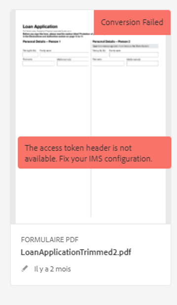
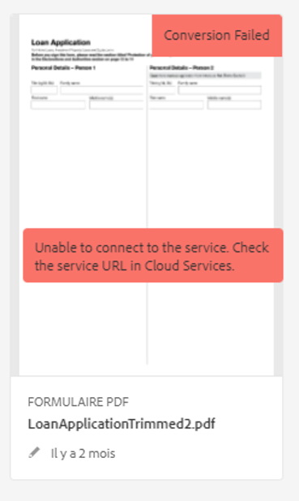
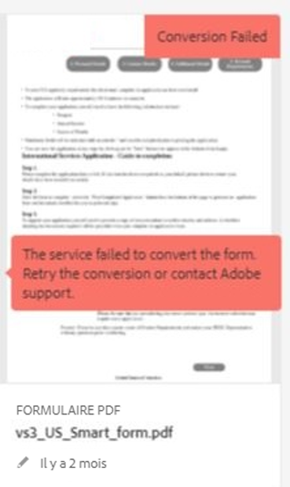
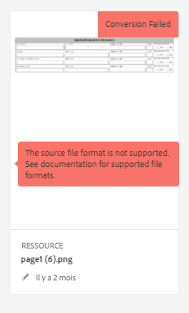
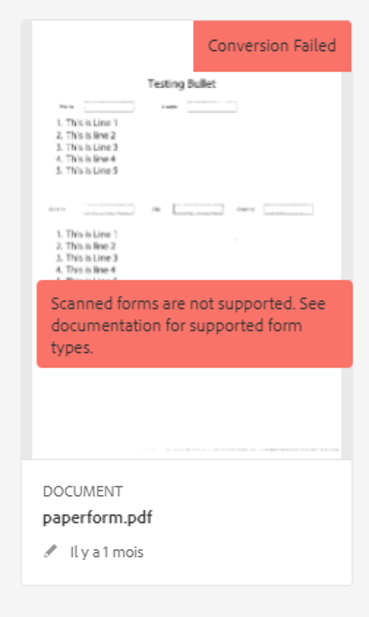
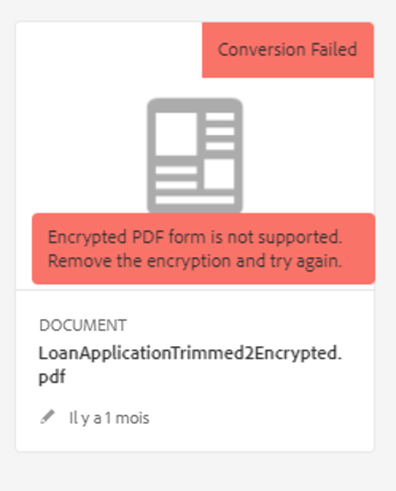
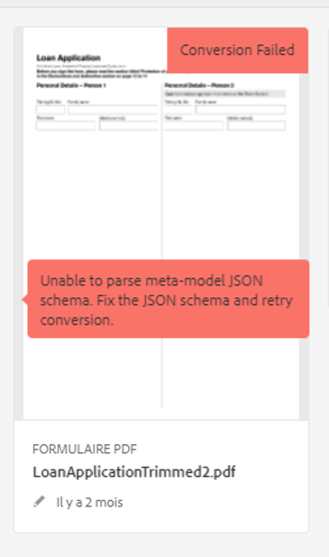
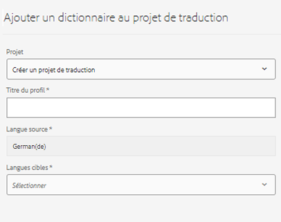

# Résolution des problèmes du service de conversion automatisée de formulaires (AFCS)

Le document fournit des étapes de résolution de base pour les erreurs courantes.

<!--The article provides information on installation, configuration and administration issues that may arise in an Automated Forms Conversion Service production environment. -->

## Erreurs courantes {#commonerrors}

| Erreur | Exemple |
|--- |--- |
| **Message d’erreur**   L’en-tête du jeton d’accès n’est pas disponible.    **Raison**   Un administrateur a créé plusieurs configurations IMS ou la configuration IMS n’est pas en mesure d’accéder au service AFCS sur Adobe Cloud.   **Résolution**   S’il existe plusieurs configurations, supprimez toutes les configurations et [créez une nouvelle configuration](configure-service.md#obtainpubliccertificates).   S’il existe une configuration unique, utilisez **Health Check** pour [vérifier la connectivité](configure-service.md#createintegrationoption). |  |
| **Message d’erreur**   Impossible de se connecter au service.    **Motif**   Une URL de service incorrecte ou aucune URL de service n’est mentionnée dans les services cloud Automated forms conversion Service (AFCS).   **Résolution**   Correct [URL du service](configure-service.md#configure-the-cloud-service) dans les services cloud Automated forms conversion Service (AFCS). |  |
| **Message d’erreur**   Le service n’est pas parvenu à convertir le formulaire.    **Raison**   Problèmes de connectivité réseau de votre côté, le service est arrêté en raison d’une maintenance planifiée, ou interruption sur Adobe Cloud.   **Résolution**   Résolvez les problèmes de connectivité réseau de votre côté et vérifiez l’état du service sur https://status.adobe.com/ pour voir s’il existe une interruption planifiée ou non planifiée. |  |
| **Message d’erreur**   Le nombre de pages est supérieur à 15.    **Raison**   Le formulaire source comporte plus de 15 pages.    **Résolution**   Utilisez Adobe Acrobat pour scinder les formulaires de plus de 15 pages. Réduisez le nombre de pages pour obtenir un formulaire ne dépassant pas 15 pages. |  |
| **Message d’erreur**   Le nombre de fichiers est supérieur à 15.    **Raison**    Le dossier contient plus de 15 formulaires.   **Résolution**   Réduisez le nombre de formulaires dans un dossier pour en obtenir 15 ou moins. Réduisez le nombre total de pages pour obtenir un dossier comportant moins de 50 pages. Réduisez la taille du dossier pour qu’elle ne dépasse pas 10 Mo. Ne conservez pas les formulaires dans un sous-dossier. Organisez les formulaires sources en un lot de 8 à 15 formulaires. |  |
| **Message d’erreur**   Le format du fichier source n’est pas pris en charge.    **Raison**   Le dossier contenant les formulaires sources contient des fichiers non pris en charge.   **Résolution**   Le service ne prend en charge que les fichiers .xdp et .pdf. Supprimez les fichiers avec toute autre extension du dossier et exécutez la conversion. |  |
| **Message d’erreur**   Les formulaires analysés ne sont pas pris en charge.    **Raison**   Le formulaire PDF contient uniquement des images numérisées du formulaire et ne contient aucune structure de contenu.   **Résolution**   Le service ne prend pas en charge la conversion de formulaires numérisés ou d’une image d’un formulaire en un formulaire adaptatif prêt à l’emploi. Cependant, vous pouvez utiliser Adobe Acrobat pour convertir l’image d’un formulaire en un formulaire PDF. Ensuite, utilisez le service pour convertir le formulaire PDF en un formulaire adaptatif. Utilisez toujours une image de qualité pour la conversion du formulaire dans Acrobat. Cela améliore la qualité de la conversion. |  |
| **Message d’erreur**   Le formulaire PDF chiffré n’est pas pris en charge.    **Raison**   Le dossier contient des formulaires PDF chiffrés.   **Résolution**   Le service ne prend pas en charge la conversion d’un formulaire PDF chiffré en formulaire adaptatif. Supprimez le chiffrement, téléchargez le formulaire non chiffré et exécutez la conversion. |  |
| **Message d’erreur**   Impossible d’analyser le schéma JSON du métamodèle.    **Raison**   Le schéma JSON fourni au service n’est pas correctement formaté, contient des caractères non valides ou utilise une syntaxe non valide pour mapper les composants.    **Résolution**   Vérifiez le formatage du fichier JSON. Vous pouvez utiliser n’importe quel validateur JSON en ligne pour vérifier le formatage et la structure du schéma. Consultez l’article [Étendre le métamodèle par défaut](extending-the-default-meta-model.md) pour plus d’informations sur la syntaxe des métamodèles. |  |
| **Erreur (environnements On-premise uniquement)**   L’option **[!UICONTROL Langue source]** ne répertorie pas la langue correcte d’un formulaire adaptatif.   **Raison**   La propriété jcr:language du formulaire adaptatif n’est pas définie correctement.   **Résolution**   Ouvrez CRX-DE Lite, accédez à `/content/forms/af/`, ouvrez le nœud `jcr:content` et définissez sa valeur sur la langue appropriée. Pour obtenir la liste des langues prises en charge, voir [Ajout de la prise en charge de la localisation pour les paramètres régionaux non pris en charge](https://experienceleague.adobe.com/docs/experience-manager-65/forms/manage-administer-aem-forms/supporting-new-language-localization.html?lang=fr#add-localization-support-for-non-supported-locales). |  |

<!--

<table>
<thead>
<tr>
<th>Error</th>
<th>Example</th>
</tr>
</thead>
<tbody>
<tr>
<td><strong>Error Message</strong> 
 The access token header is not available. 
 <strong>Reason</strong>   An administrator has created multiple IMS configurations or IMS configuration is not able to reach AFCS service on Adobe Cloud.   <strong>Resolution</strong>   If there are multiple configurations, delete all the configurations and <a href="configure-service.md#obtainpubliccertificates">create a new configuration</a>.   If there is a single configuration, use <strong> Health Check </strong> to <a href="configure-service.md#createintegrationoption">check connectivity</a>.</td>
<td></td>
</tr>
<tr>
<td><strong>Error Message</strong>   Unable to connect to the service.    <strong>Reason</strong>   Incorrect service URL or no service URL is mentioned in Automated Forms Conversion Service (AFCS) cloud services.   <strong>Resolution</strong>   Correct <a href="configure-service.md#configure-the-cloud-service">Service URL</a> in Automated Forms Conversion Service (AFCS) Cloud services.</td>
<td></td>
</tr>
<tr>
<td><strong>Error Message</strong>   The service failed to convert the form.    <strong>Reason</strong>   Network connectivity issues at your end, the service is down due to scheduled maintenance, or outage on Adobe Cloud.   <strong>Resolution</strong>   Resolve network connectivity issues at your end and check the status of the service on <a href="https://status.adobe.com/">https://status.adobe.com/</a> for a planned or unplanned outage.</td>
<td></td>
</tr>
<tr>
<td><strong>Error Message</strong>   The number of pages is more than 15.    <strong>Reason</strong>   The source form is more than 15 pages long.    <strong>Resolution</strong>   Use Adobe Acrobat to split forms with more than 15 pages. Bring the number of pages in a form to less than 15.</td>
<td></td>
</tr>
<tr>
<td><strong>Error Message</strong>   The number of files is more than 15.    <strong>Reason</strong>    The folder contains more than 15 forms.   <strong>Resolution</strong>   Bring the number of forms in a folder to less than or equal to 15. Bring the total number of pages in a folder less than 50. Bring the size of the folder to less than 10 MB. Do not keep forms in a sub-folder. Organize source forms into a batch of 8-15 forms.</td>
<td></td>
</tr>
<tr>
<td><strong>Error Message</strong>   The source file format is not supported.    <strong>Reason</strong>   The folder containing source forms have some unsupported files.   <strong>Resolution</strong>   The service supports only .xdp and .pdf files. Remove files with any other extension from the folder and run the conversion.</td>
<td></td>
</tr>
<tr>
<td><strong>Error Message</strong>   Scanned forms are not supported.    <strong>Reason</strong>   The PDF form contains only scanned images of the form and contains no content structure.   <strong>Resolution</strong>   The service does not support converting scanned forms or an image of a form to an adaptive out-of-the-box. However, you use Adobe Acrobat to convert the image of a form to a PDF Form. Then, use the service to convert the PDF Form to an adaptive form. Always use a high-quality image of the form for conversion in Acrobat. It improves the quality of the conversion.</td>
<td></td>
</tr>
<tr>
<td><strong>Error Message</strong>   Encrypted PDF form is not supported.    <strong>Reason</strong>   The folder contains encrypted PDF forms.   <strong>Resolution</strong>   The service does not support converting an encrypted PDF form to an adaptive form. Remove the encryption, upload the non-encrypted form, and run the conversion.</td>
<td></td>
</tr>
<tr>
<td><strong>Error Message</strong>   Unable to parse meta-model JSON schema.    <strong>Reason</strong>   The JSON schema supplied to the service is not properly formatted, contains invalid characters, or uses invalid syntax to map components.    <strong>Resolution</strong>   Check the formatting of the JSON file. You can use any online JSON validator to check the formatting and structure of the schema. See, <a href="extending-the-default-meta-model.md">Extend the default meta-model</a> article for information on meta-model syntax.</td>
<td></td>
</tr>
</tbody>
</table>
-->
